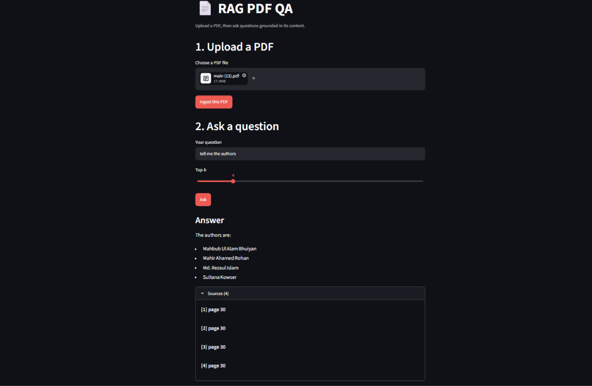

# RAG PDF QA

An end-to-end Retrieval-Augmented Generation (RAG) application for asking
questions about uploaded PDF documents. The system extracts PDF text, splits
it into searchable chunks, stores vector embeddings in a local FAISS index, and
uses a Groq-powered chat model to generate answers grounded in the retrieved
document context.

## Demo



The Streamlit interface supports:

- PDF upload and ingestion
- Local FAISS vector indexing
- Configurable Top-k retrieval
- Answers grounded in the uploaded document
- Retrieved source pages for transparency

## Architecture

```text
Streamlit frontend
        |
        | HTTP
        v
FastAPI backend
        |
        +--> PyPDFLoader
        +--> RecursiveCharacterTextSplitter
        +--> HuggingFaceEmbeddings
        +--> FAISS local vector store
        +--> Retriever + ChatGroq
```

## Project structure

```text
RAG_QA/
├── backend/
│   └── app/
│       ├── config.py       # Environment-backed application settings
│       ├── db.py           # FAISS persistence and retrieval helpers
│       ├── embedding.py    # Hugging Face embedding model
│       ├── ingestion.py    # PDF loading and document chunking
│       ├── main.py         # FastAPI endpoints
│       └── rag_chain.py    # Retrieval and question-answering chain
├── frontend/
│   └── app.py              # Streamlit user interface
├── docs/
│   └── assets/
│       └── rag-pdf-qa-demo.png
└── README.md
```

## Requirements

- Python 3.10 or newer
- A Groq API key
- Internet access on first model use so Hugging Face can download the
  embedding model

The application uses FastAPI, Uvicorn, Streamlit, LangChain, LangChain
Community, LangChain Hugging Face, LangChain Groq, PyPDF, FAISS, Requests,
python-dotenv, and Sentence Transformers.

## Installation

Create and activate a virtual environment from the repository root:

### Windows PowerShell

```powershell
python -m venv .venv
.\.venv\Scripts\Activate.ps1
```

Install the application dependencies:

```powershell
pip install fastapi uvicorn streamlit requests python-dotenv `
  langchain langchain-core langchain-community langchain-text-splitters `
  langchain-huggingface langchain-groq pypdf faiss-cpu sentence-transformers
```

## Configuration

Create a `.env` file in the directory from which the backend is started:

```env
GROQ_API_KEY=your_groq_api_key
LLM_MODEL=llama-3.1-8b-instant
```

Optional settings:

```env
BACKEND_URL=http://localhost:8000
COLLECTION=pdf_docs
FAISS_INDEX_DIR=./.faiss_index
```

Never commit `.env` or API keys to source control.

## Run locally

Open two terminals from the repository root.

### 1. Start the FastAPI backend

```powershell
cd backend
..\.venv\Scripts\python.exe -m uvicorn app.main:app --reload
```

The API is available at <http://localhost:8000>.

Interactive API documentation is available at:

- Swagger UI: <http://localhost:8000/docs>
- ReDoc: <http://localhost:8000/redoc>

### 2. Start the Streamlit frontend

```powershell
cd frontend
..\.venv\Scripts\python.exe -m streamlit run app.py
```

The UI is available at <http://localhost:8501>.

## How to use

1. Open the Streamlit UI.
2. Select a PDF file.
3. Click **Ingest this PDF** and wait for indexing to finish.
4. Enter a question about the document.
5. Select the desired Top-k value.
6. Click **Ask** to see the answer and retrieved source pages.

## API reference

### Health check

```http
GET /health
```

Example response:

```json
{
  "status": "ok"
}
```

### Ingest a PDF

```http
POST /ingest
Content-Type: multipart/form-data
```

Form fields:

- `file`: PDF file
- `collection`: Optional FAISS collection name; defaults to `pdf_docs`

Example response:

```json
{
  "message": "PDF ingested successfully.",
  "pages": 30,
  "chunks": 72,
  "collection": "pdf_docs"
}
```

### Ask a question

```http
POST /ask
Content-Type: application/json
```

Request body:

```json
{
  "question": "Who are the authors?",
  "collection": "pdf_docs",
  "k": 4
}
```

The response contains the generated answer and the document pages used as
retrieval sources.

## Data and security notes

- FAISS indexes are stored locally under `.faiss_index` by default.
- Loading an existing FAISS index enables
  `allow_dangerous_deserialization=True`; only load indexes created by a
  trusted source.
- Uploaded PDFs are written to a temporary file during ingestion and removed
  after processing.
- CORS is currently permissive for local development. Restrict
  `allow_origins` before deploying publicly.

## Troubleshooting

### `FAISS.load_local() missing ... 'embeddings'`

Make sure the backend is restarted after updating the FAISS persistence code.
The embedding object must be supplied to `FAISS.load_local`.

### `KeyError: 'pages'` after ingestion

The frontend expects the ingestion statistics (`pages`, `chunks`, and
`collection`) in the `/ingest` response. Restart the backend so it loads the
current API implementation.

### `"'dict' object has no attribute 'replace'"`

This occurs when the RAG chain receives a dictionary where the prompt expects
the question string. The chain should be invoked with the question string:

```python
answer = chain.invoke(question)
```

### Collection does not exist

Ingest a PDF before asking a question, and use the same collection name for
both operations. The default collection is `pdf_docs`.

## License

This project does not currently declare a license. Add a license before
redistributing it.
